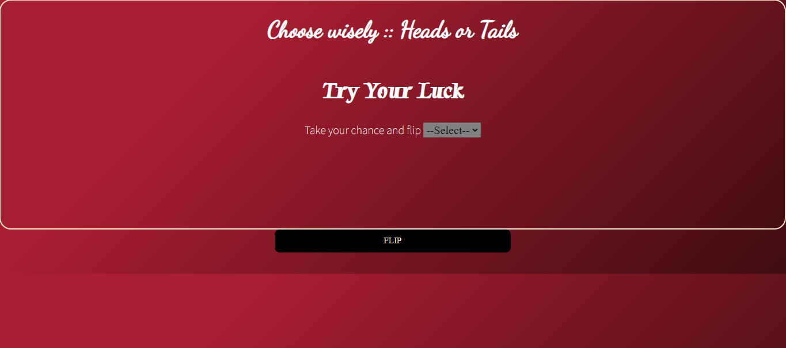

# 💸 Week08 Bootcamp2019a Project: Node Coin Flip Game

### Goal: Create a simple web application that uses the fs and http modules. Use http to create the server and fs to read your html file. Include vanilla ES6 js in a script tag at the bottom of your html file. Try creating a coin flip guessing game

**Link to project:https://ddcoingame.netlify.app/
 

 
## How It's Made:
 
**Tech used:** HTML, CSS, JavaScript,Node.js
 
 
I utilized my skills in Node.js, javaScript, HTML and CSS to make this interactive application using a server js file to act as a back end for the randomization feautues seen in this application. User's are allowed to have multiple attempts at picking the right coin side with their 50/50 chance.
## Lessons Learned:
I learned how to send information back to the client side using the url I created
